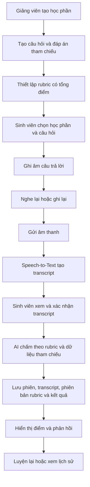
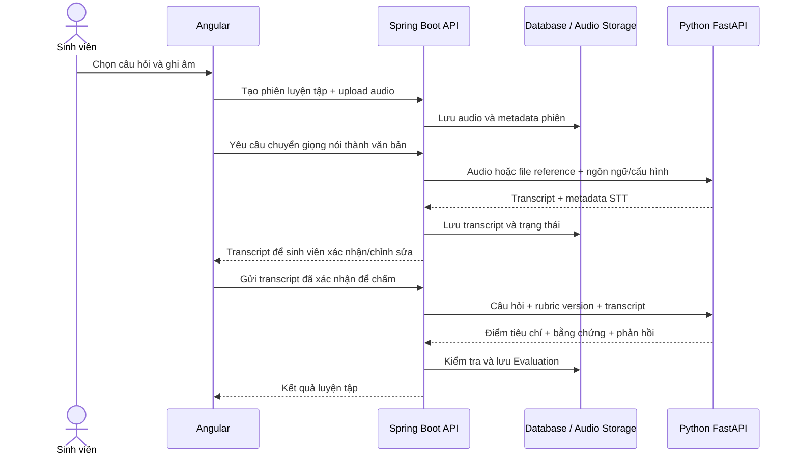

# Kế hoạch thực hiện đồ án nghiên cứu khoa học

## 1. Tên đề tài dự kiến

**Xây dựng và đánh giá hệ thống hỗ trợ ôn luyện thi vấn đáp bằng nhận dạng tiếng nói và chấm câu trả lời theo rubric có hỗ trợ AI.**

Tên có thể điều chỉnh theo mẫu đăng ký của khoa. Sản phẩm phục vụ **luyện tập**, không dùng làm căn cứ cho điểm thi chính thức.

## 2. Căn cứ và phạm vi

Kế hoạch này kết hợp tài liệu phân tích chức năng được cung cấp với repo tham khảo [speed-to-text-demo](https://github.com/luannguyenn889/speed-to-text-demo).

**Trạng thái khảo sát repo:** tại thời điểm lập kế hoạch, trang repo và các tệp README/raw không tải được trong môi trường làm việc; workspace hiện chỉ có `ex.txt` chứa URL. Vì vậy, chưa xác minh được mã nguồn, framework, API, giấy phép, cách chạy hay hành vi thật của demo. Không nên coi “speed-to-text” trong tên repo là bằng chứng về chức năng cụ thể. Tuần 1 cần mở repo từ máy của nhóm, ghi nhận commit/nhánh, đọc README và chạy demo trước khi quyết định tái sử dụng hoặc tích hợp.

### Phạm vi phiên bản nghiên cứu (MVP)

- Một học phần thử nghiệm, một nhóm câu hỏi do giảng viên cung cấp.
- Sinh viên chọn câu hỏi, ghi âm câu trả lời, nghe lại, gửi bài.
- Hệ thống chuyển tiếng nói tiếng Việt thành văn bản, cho phép xem/sửa transcript trước khi chấm.
- AI đánh giá nội dung theo đáp án tham chiếu và rubric có cấu trúc do giảng viên thiết lập.
- Hiển thị điểm theo tiêu chí, phần đúng, phần thiếu/sai, giải thích và gợi ý luyện lại.
- Lưu lịch sử phiên luyện tập và phiên bản rubric/prompt đã dùng.
- Có quy trình giảng viên chấm bộ câu trả lời mẫu để đối chiếu với AI.

### Ngoài phạm vi bản đầu

Tổ chức kỳ thi chính thức; giám sát chống gian lận; nhận diện khuôn mặt/cảm xúc; hội thoại giọng nói hai chiều; hỗ trợ nhiều học phần quy mô lớn; huấn luyện mô hình nhận dạng tiếng nói riêng. Chỉ đưa các mục này vào nếu còn thời gian và có lý do nghiên cứu.

## 3. Bài toán, mục tiêu và câu hỏi nghiên cứu

### Bài toán

Sinh viên khó tự luyện trả lời vấn đáp và khó biết câu trả lời đã đủ ý hay chưa. Giảng viên có thể cung cấp câu hỏi, đáp án mong đợi và tiêu chí chấm; hệ thống dùng các dữ liệu đó để tạo phản hồi nhất quán, có thể kiểm tra lại.

### Mục tiêu

1. Xây dựng web app có luồng luyện vấn đáp hoàn chỉnh từ câu hỏi đến phản hồi.
2. Đo chất lượng nhận dạng tiếng Việt trên tập ghi âm thử nghiệm của đề tài.
3. Đánh giá mức độ phù hợp của điểm AI so với điểm giảng viên theo rubric.
4. Khảo sát khả dụng và mức hữu ích của phản hồi đối với sinh viên.

### Câu hỏi nghiên cứu đề xuất

- Q1: Transcript tự động ảnh hưởng thế nào đến điểm AI so với transcript đã được người dùng hiệu chỉnh?
- Q2: Điểm tổng và điểm từng tiêu chí do AI đưa ra gần với đánh giá của giảng viên đến mức nào?
- Q3: Sinh viên có hoàn thành được phiên luyện tập và thấy phản hồi dễ hiểu, hữu ích không?

Các câu hỏi trên là đề xuất để đo lường, cần thống nhất với giảng viên hướng dẫn trước khi thu thập dữ liệu.

## 4. Tác nhân và chức năng

| Mã | Chức năng | Tác nhân | Mức ưu tiên |
|---|---|---|---|
| F01 | Đăng nhập, phân quyền cơ bản | Sinh viên, giảng viên, quản trị viên | MVP |
| F02 | Quản lý học phần thử nghiệm | Giảng viên | MVP |
| F03 | Tạo/sửa câu hỏi, chủ đề, đáp án tham chiếu | Giảng viên | MVP |
| F04 | Thiết lập rubric: tiêu chí, mô tả, điểm tối đa, hướng dẫn bổ sung | Giảng viên | MVP |
| F05 | Chọn học phần/câu hỏi hoặc lấy câu hỏi ngẫu nhiên | Sinh viên | MVP |
| F06 | Ghi âm, dừng, nghe lại, gửi câu trả lời | Sinh viên | MVP |
| F07 | Chuyển âm thanh sang văn bản, cho xem transcript | Hệ thống | MVP |
| F08 | Chấm câu trả lời theo rubric và tạo phản hồi có cấu trúc | Hệ thống AI | MVP |
| F09 | Xem điểm, lý do, ý đúng/thiếu/sai và gợi ý cải thiện | Sinh viên | MVP |
| F10 | Lưu lịch sử và xem lại kết quả | Sinh viên | Giai đoạn hoàn thiện |
| F11 | So sánh điểm AI và điểm giảng viên trên câu trả lời mẫu | Giảng viên | Kiểm chứng nghiên cứu |
| F12 | Quản lý tài khoản/cấu hình vận hành | Quản trị viên | Tối giản hoặc hoãn |

## 5. Luồng hoạt động nghiệp vụ

### 5.1 Luồng chuẩn



Speech-to-Text và chấm điểm là hai bước tuần tự. Cần tách lỗi của từng bước để biết kết quả kém do nhận dạng âm thanh hay do đánh giá nội dung.

### 5.2 Trạng thái phiên luyện tập

`draft → recording → uploaded → transcribing → transcript_review → grading → completed`

Các trạng thái lỗi cần thể hiện rõ: `transcription_failed`, `grading_failed`, `cancelled`. Khi lỗi, giữ bản ghi nếu chính sách lưu trữ cho phép, cho phép thử lại từng bước và không tạo nhiều kết quả trùng lặp.

### 5.3 Luồng đối soát nghiên cứu

1. Chọn một tập câu trả lời ẩn danh, có đồng ý sử dụng cho nghiên cứu.
2. Giảng viên chấm độc lập theo cùng rubric; lưu điểm từng tiêu chí và nhận xét.
3. Chạy AI với transcript đã xác nhận và lưu phiên bản mô hình/prompt.
4. So sánh cặp điểm giảng viên–AI; phân tích chênh lệch tổng và theo tiêu chí.
5. Xem lại các trường hợp lệch lớn, điều chỉnh hướng dẫn chấm nếu cần, rồi chạy lại trên tập kiểm thử tách biệt.

## 6. Khảo sát và quyết định tích hợp repo tham khảo

Repo chỉ nên được dùng làm **mẫu tham khảo hoặc thành phần** sau khi kiểm tra các mục sau:

| Hạng mục khảo sát | Cần ghi nhận | Quyết định ảnh hưởng |
|---|---|---|
| Cấu trúc và công nghệ | Frontend/backend, ngôn ngữ, framework, lệnh chạy | Tương thích với nền tảng nhóm dự định xây |
| Luồng hiện có | Dữ liệu đầu vào, thao tác người dùng, đầu ra, trạng thái lỗi | Có thể tái sử dụng UI hay luồng nhập âm thanh không |
| Chuyển giọng nói | Dịch vụ/mô hình, ngôn ngữ, định dạng/giới hạn file, transcript | Có đáp ứng tiếng Việt và dữ liệu nghiên cứu không |
| API và lưu trữ | Endpoint, xác thực, nơi lưu audio/transcript, giới hạn tải lên | Tích hợp và bảo vệ dữ liệu |
| Chất lượng mã | Hướng dẫn chạy, cấu hình, phụ thuộc, kiểm thử, cập nhật gần nhất | Chi phí sửa đổi và rủi ro kỹ thuật |
| Giấy phép và dữ liệu | License, quyền dùng mã/tài sản, chính sách dữ liệu | Có được phép dùng/chỉnh sửa trong đồ án không |

**Quy tắc quyết định:** nếu repo chỉ minh họa chuyển âm thanh thành văn bản, đánh giá khả năng tái sử dụng như một thành phần STT phía Python/FastAPI, sau khi kiểm tra giấy phép và API. Chức năng tài khoản, ngân hàng câu hỏi, rubric, lịch sử và đo kiểm nghiên cứu do Spring Boot quản lý; giao diện được xây bằng Angular. Nếu repo không có API tích hợp ổn định, chỉ tham khảo luồng/UI và xây adapter STT riêng trong AI service. Không đưa audio hoặc thông tin cá nhân lên dịch vụ ngoài trước khi xác định nơi lưu, thời hạn lưu và sự đồng ý của người tham gia.

### Phiếu khảo sát repo cần điền ở tuần 1

- Commit/branch khảo sát:
- Công nghệ và lệnh chạy:
- Luồng thao tác thực tế:
- Input/output và giới hạn file:
- API có thể gọi (nếu có):
- License:
- Phần có thể tái sử dụng:
- Phần phải tự xây:
- Quyết định: dùng / tham khảo / không dùng, lý do:

## 7. Thiết kế dữ liệu và hợp đồng đầu ra AI

### Thực thể cốt lõi

- `User`: id, tên hiển thị, email, vai trò.
- `Course`: id, mã, tên, giảng viên phụ trách.
- `Question`: id, course_id, chủ đề, nội dung, đáp án tham chiếu, trạng thái.
- `RubricVersion`: question_id, version, tiêu chí, thang điểm, hướng dẫn, ngày tạo.
- `PracticeSession`: student_id, question_id, trạng thái, thời điểm, audio_ref (nếu có), transcript, phiên bản STT.
- `Evaluation`: session_id, rubric_version_id, model/prompt version, tổng điểm, điểm tiêu chí, phản hồi, thời gian xử lý.
- `HumanReview`: session_id, giảng viên, điểm tiêu chí, nhận xét, thời điểm.

Lưu rubric/prompt theo phiên bản để tái lập kết quả; không ghi đè phiên bản đã dùng. Phân quyền dữ liệu theo vai trò và chỉ giữ audio trong thời gian đã công bố.

### Đầu ra chấm AI dạng cấu trúc

```json
{
  "total_score": 7.5,
  "max_score": 10,
  "criteria": [
    {
      "criterion_id": "concept",
      "score": 3,
      "max_score": 4,
      "evidence": "Transcript có nêu được định nghĩa ...",
      "missing_or_incorrect": ["Chưa giải thích ..."],
      "feedback": "Bổ sung ..."
    }
  ],
  "strengths": ["..."],
  "improvements": ["..."],
  "uncertainty_notes": ["..."],
  "needs_human_review": false
}
```

AI chỉ chấm theo thông tin câu hỏi, rubric và tài liệu được giảng viên cung cấp. Phản hồi phải phân biệt điều có căn cứ trong transcript với suy đoán; không chấm đặc điểm giọng nói/cảm xúc trong MVP. Backend cần kiểm tra JSON, tổng điểm, điểm tối đa và tiêu chí trước khi lưu.

## 8. Kiến trúc dự kiến

Stack đã chốt: **Angular (frontend) + Spring Boot (backend nghiệp vụ) + Python FastAPI (AI service)**. Tách service AI khỏi backend nghiệp vụ để có thể thay model/provider STT hoặc LLM mà không làm thay đổi các luồng tài khoản, học phần và lịch sử.

1. **Angular Web App:** giao diện sinh viên/giảng viên; thu âm qua API trình duyệt; gửi audio, hiển thị tiến độ xử lý, cho xác nhận transcript, xem rubric/kết quả và lịch sử.
2. **Spring Boot API:** xác thực và phân quyền; quản lý học phần/câu hỏi/rubric; tạo phiên luyện tập; kiểm tra quyền sở hữu; lưu metadata, transcript, kết quả; cung cấp API cho Angular; gọi AI service.
3. **Python FastAPI AI service:** nhận yêu cầu STT và đánh giá; quản lý adapter tới mô hình/nhà cung cấp; nhận audio hoặc tham chiếu file; chuyển giọng nói thành văn bản; chấm transcript theo câu hỏi/rubric; trả JSON có cấu trúc cùng metadata mô hình và thời gian xử lý. Service này không phải nguồn dữ liệu chính của người dùng/học phần.
4. **Cơ sở dữ liệu:** Spring Boot quản lý dữ liệu nghiệp vụ và phiên luyện tập. Thiết kế DB theo hệ quản trị nhóm lựa chọn; lưu phiên bản rubric, cấu hình AI và trạng thái job để tái lập kết quả.
5. **Lưu trữ audio:** lưu ở object storage hoặc vùng lưu riêng, không phục vụ trực tiếp bằng đường dẫn công khai. Spring Boot cấp quyền truy cập hoặc URL có thời hạn cho FastAPI; áp dụng thời hạn xóa đã công bố.
6. **Research export:** Spring Boot xuất tập dữ liệu đã khử định danh để phân tích; giới hạn quyền tải và loại bỏ thông tin bí mật.

### Luồng giao tiếp giữa các thành phần



### Ranh giới API đề xuất

- **Angular → Spring Boot:** REST/JSON cho đăng nhập, học phần, câu hỏi, rubric, phiên, transcript đã xác nhận, kết quả và lịch sử. Upload audio có thể dùng multipart; giới hạn định dạng/kích thước phải được kiểm tra ở backend.
- **Spring Boot → FastAPI:** API nội bộ, không để browser gọi trực tiếp AI service. Các thao tác gợi ý: `POST /ai/transcriptions`, `POST /ai/evaluations`, `GET /health`.
- **Request đánh giá:** gồm `session_id`, `question`, `rubric_version`, `criteria`, `reference_answer`, `transcript`; không gửi thông tin nhận dạng sinh viên nếu AI không cần.
- **Response:** có schema và mã phiên bản, gồm transcript hoặc evaluation, model/provider, thời gian xử lý, lỗi chuẩn hóa. Spring Boot xác thực điểm và tiêu chí trước khi ghi DB.
- **Xử lý lâu:** nếu STT/chấm vượt thời gian phản hồi phù hợp, Spring Boot tạo job và trả `job_id`; Angular truy vấn trạng thái định kỳ. MVP có thể dùng request đồng bộ nếu thử nghiệm cho thấy độ trễ chấp nhận được.

FastAPI chỉ được gọi trong mạng/backend đáng tin cậy; dùng xác thực service-to-service, timeout, giới hạn kích thước upload và xử lý lỗi rõ ràng. Thiết kế này giữ trách nhiệm dữ liệu nghiệp vụ ở Spring Boot, còn FastAPI tập trung vào pipeline AI.

### 8.1. Triển khai frontend trước

Frontend có thể triển khai trước bằng Angular và dữ liệu mock, dựa trên DTO/API đã thống nhất với Spring Boot. Thứ tự nên là: chọn câu hỏi → ghi âm/phát lại → xác nhận transcript → xem kết quả → lịch sử → màn hình quản lý câu hỏi/rubric. Khi backend sẵn sàng, thay mock service bằng HTTP service theo từng lát cắt. Chi tiết route, cấu trúc mã, hợp đồng và tiêu chí bàn giao nằm trong [kế hoạch Frontend Angular](D:/ai-oral-exam-practice/KE_HOACH_FRONTEND_ANGULAR.md).

## 9. Giao diện và tiêu chí nghiệm thu chức năng

### Sinh viên

- Dashboard: học phần, nút bắt đầu, phiên gần nhất.
- Chọn câu hỏi: lọc chủ đề, câu hỏi cụ thể/ngẫu nhiên.
- Luyện tập: câu hỏi, đồng hồ tùy chọn, trạng thái micro, ghi/dừng/nghe lại/gửi.
- Xem transcript: xác nhận/chỉnh sửa trước chấm; lưu rõ transcript đã gửi.
- Kết quả: tổng điểm, từng tiêu chí, bằng chứng, thiếu/sai, cách cải thiện, luyện lại.
- Lịch sử: xem phiên trước và xu hướng điểm.

### Giảng viên

- Quản lý học phần, câu hỏi, đáp án/tài liệu tham chiếu.
- Tạo rubric có tổng điểm kiểm tra được và phiên bản.
- Xem/chấm bộ câu trả lời mẫu, so sánh với AI và ghi chú sai lệch.

### Tiêu chí nghiệm thu MVP

- Hoàn tất được một phiên từ chọn câu hỏi đến xem phản hồi mà không cần thao tác ngoài hệ thống.
- Không gửi chấm nếu thiếu transcript/rubric hợp lệ; lỗi được hiển thị và có thể thử lại.
- Kết quả lưu đúng câu hỏi, người học, transcript, phiên bản rubric và cấu hình AI.
- Tổng điểm nằm trong thang điểm; điểm tiêu chí không vượt điểm tối đa; đầu ra hiển thị nhất quán.
- Sinh viên không xem dữ liệu của người khác; giảng viên chỉ truy cập học phần được phân công.
- Người dùng biết rõ AI hỗ trợ luyện tập, kết quả có thể sai và cần đối chiếu tài liệu/giảng viên.

## 10. Kế hoạch nghiên cứu và đánh giá

### Dữ liệu đánh giá

- Chọn câu hỏi đại diện cho các chủ đề trong học phần.
- Thu câu trả lời tự nguyện theo quy trình được giảng viên/trường chấp thuận.
- Ẩn danh mã sinh viên trong tập phân tích.
- Giảng viên chấm theo rubric đã khóa phiên bản; nếu khả thi, có hai người chấm một phần mẫu để xem mức nhất quán giữa người chấm.
- Tách dữ liệu dùng tinh chỉnh hướng dẫn/prompt và dữ liệu đánh giá cuối; không báo cáo độ chính xác trên chính tập đã dùng để điều chỉnh.

### Chỉ số đề xuất

| Nhóm | Chỉ số |
|---|---|
| Speech-to-Text | WER/CER trên transcript tham chiếu đã được hiệu chỉnh; thời gian xử lý; tỷ lệ lỗi |
| Chấm điểm | MAE/RMSE điểm tổng; sai lệch trung bình; tỷ lệ chênh không quá ngưỡng đã xác định; tương quan/độ đồng thuận phù hợp với loại thang đo |
| Theo rubric | Sai số điểm theo từng tiêu chí; các trường hợp AI nêu bằng chứng không có trong transcript |
| Khả dụng | Tỷ lệ hoàn tất nhiệm vụ; lỗi thao tác; thời gian hoàn thành; khảo sát ngắn về dễ dùng/hữu ích |

Không coi tương quan cao là đủ chứng minh hai cách chấm tương đương; cần xem phân bố chênh lệch và các trường hợp bất đồng lớn. Chốt ngưỡng đạt sau khi thống nhất với giảng viên hướng dẫn và đặc điểm rubric.

## 11. Tiến độ đề xuất (12 tuần)

| Tuần | Công việc | Đầu ra / cổng quyết định |
|---|---|---|
| 1 | Đọc thuyết minh; khảo sát, chạy repo; hỏi giảng viên về học phần và dữ liệu | Phiếu khảo sát repo; phạm vi, stack và quyết định dùng/tham khảo |
| 2 | Đặc tả yêu cầu, use case, luồng nghiệp vụ, tiêu chí đánh giá | SRS rút gọn; sơ đồ use case/flow; câu hỏi nghiên cứu |
| 3 | Thiết kế wireframe, dữ liệu, kiến trúc, hợp đồng API/AI | Prototype và mô hình dữ liệu được duyệt |
| 4 | Đăng nhập/phân quyền, học phần, câu hỏi | Luồng quản trị nội dung dùng được |
| 5 | Rubric có cấu trúc và phiên bản | Giảng viên tạo được câu hỏi/rubric hợp lệ |
| 6 | Ghi âm, tải lên, phát lại, trạng thái lỗi | Audio đi hết vòng đời cơ bản |
| 7 | Tích hợp STT và màn hình xác nhận transcript | Transcript được lưu, thử lại được, có metadata |
| 8 | Tích hợp chấm AI theo rubric, validate kết quả | Kết quả chấm có cấu trúc và lý do |
| 9 | Lịch sử, xử lý lỗi, bảo vệ dữ liệu, hoàn thiện giao diện | Bản MVP đóng băng chức năng |
| 10 | Chạy thử với nhóm nhỏ, sửa lỗi; chuẩn bị protocol nghiên cứu | Bản thử nghiệm và quy trình thu dữ liệu |
| 11 | Thu/chấm tập đánh giá, đối soát, khảo sát người dùng | Bộ dữ liệu ẩn danh và bảng kết quả |
| 12 | Phân tích, viết báo cáo, demo, hoàn thiện tài liệu | Báo cáo NCKH, hướng dẫn sử dụng, demo |

Nếu thời gian ngắn hơn, ưu tiên F03–F09 và đối soát một tập câu trả lời nhỏ; hoãn dashboard tiến độ và quản trị viên nâng cao.

## 12. Rủi ro và phương án giảm thiểu

| Rủi ro | Ảnh hưởng | Cách xử lý |
|---|---|---|
| Repo không truy cập được/không phù hợp | Chậm chọn công nghệ | Tuần 1 kiểm tra từ máy nhóm; giữ adapter và phương án tự triển khai độc lập |
| Nhận dạng tiếng Việt sai do ồn/giọng vùng miền | Sai transcript kéo theo sai điểm | Cho sửa transcript; tách đo STT khỏi đo chấm; lưu transcript tham chiếu |
| Điểm AI không ổn định hoặc bịa bằng chứng | Phản hồi gây hiểu nhầm | Rubric cụ thể, đầu ra cấu trúc, kiểm tra bằng chứng, lưu phiên bản, giảng viên đối soát |
| Lộ audio hoặc thông tin sinh viên | Rủi ro quyền riêng tư | Thu tối thiểu, phân quyền, ẩn danh, thời hạn xóa, xin đồng ý trước khi thu |
| Chi phí/giới hạn dịch vụ AI | Gián đoạn demo/thu mẫu | Ước tính trước, giới hạn thời lượng, cache kết quả nghiên cứu, có mock provider cho phát triển |
| Rubric không nhất quán giữa câu hỏi | Không so sánh được kết quả | Chuẩn hóa hướng dẫn chấm, tập huấn người chấm, lưu phiên bản rubric |

## 13. Phân công nhóm (điều chỉnh theo nhân lực)

- **Phân tích/nghiên cứu:** tổng quan tài liệu, câu hỏi nghiên cứu, protocol, khảo sát người dùng, phân tích chỉ số.
- **Frontend (Angular):** màn hình sinh viên/giảng viên, ghi âm, transcript, kết quả và trạng thái lỗi.
- **Backend/dữ liệu (Spring Boot):** xác thực, phân quyền, API, DB, lưu audio, lịch sử và xuất dữ liệu ẩn danh.
- **AI service (Python FastAPI):** adapter STT/LLM, thiết kế đầu vào rubric, schema output, logging phiên bản và đánh giá sai số.
- **Tích hợp/QA học thuật:** chạy kịch bản đầu cuối, kiểm tra theo rubric, tài liệu demo và báo cáo.

Với nhóm nhỏ, một người có thể đảm nhiệm nhiều vai trò; cần một người phụ trách xuyên suốt dữ liệu nghiên cứu và phiên bản đánh giá.

## 14. Danh sách sản phẩm bàn giao

- Đặc tả yêu cầu và use case.
- Sơ đồ kiến trúc, luồng nghiệp vụ, mô hình dữ liệu/API.
- Wireframe các màn hình chính.
- Web app MVP và hướng dẫn cài/chạy.
- Bộ câu hỏi, rubric và tập đánh giá đã được phép sử dụng, khử định danh.
- Nhật ký cấu hình STT/LLM và phiên bản prompt/rubric.
- Bảng kết quả định lượng, phân tích trường hợp sai lệch và khảo sát khả dụng.
- Báo cáo NCKH, slide và kịch bản demo.

## 15. Việc cần làm ngay

1. Mở repo từ trình duyệt/máy có quyền truy cập, kiểm tra README, license, nhánh/commit và chạy demo; điền phiếu ở mục 6.
2. Chốt với giảng viên: học phần thử nghiệm, bộ câu hỏi, rubric, người chấm tham chiếu và quyền thu/lưu audio.
3. Chọn một câu hỏi và rubric mẫu để dựng prototype luồng audio → transcript → xác nhận → chấm → phản hồi.
4. Chốt protocol đo STT và độ lệch điểm trước khi thu dữ liệu chính thức.

---

**Lưu ý học thuật:** mọi số liệu về chất lượng hệ thống phải được đo trên dữ liệu thử nghiệm thực tế của đề tài; không đưa trước kết luận rằng AI chấm chính xác hoặc tương đương giảng viên.
