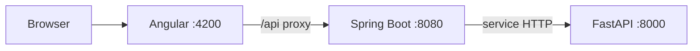

# AI Oral Exam Practice

Khung dự án ban đầu gồm ba service độc lập: Angular frontend, Spring Boot backend và FastAPI AI service. Spring Boot là API duy nhất mà trình duyệt gọi; Spring Boot gọi AI service nội bộ. Hiện tại chỉ có endpoint health để kiểm tra kết nối, chưa triển khai nghiệp vụ STT/chấm điểm.



## Cấu trúc

```text
frontend/       Angular UI và API client
backend/        Spring Boot API nghiệp vụ, health check AI
ai-service/     FastAPI, điểm vào cho pipeline STT/LLM
plan/           Product backlog và kế hoạch Scrum 12 tuần
```

## Yêu cầu môi trường

- Node.js 22.12 trở lên và npm 10+ cho Angular 21.
- Java 21 và Maven 3.6.3 trở lên cho Spring Boot.
- Python 3.10 trở lên và `uv` hoặc `pip` cho FastAPI.

## Chạy từng service trên Windows PowerShell

Mở ba terminal riêng tại thư mục dự án.

### 1. AI service

```powershell
cd ai-service
py -m venv .venv
.\.venv\Scripts\Activate.ps1
python -m pip install -e .
python -m uvicorn app.main:app --reload --host 127.0.0.1 --port 8000
```

Nếu chính sách PowerShell chặn activate, chạy trực tiếp ` .\.venv\Scripts\python.exe -m pip install -e .` và ` .\.venv\Scripts\python.exe -m uvicorn ...` (bỏ khoảng trắng đầu lệnh).

### 2. Backend

```powershell
cd backend
mvn spring-boot:run
```

### 3. Frontend

```powershell
cd frontend
npm.cmd install
npm.cmd start
```

Mở `http://localhost:4200`. Frontend dùng proxy `/api` sang Spring Boot. Backend health endpoint là `http://localhost:8080/api/health`; AI health endpoint là `http://localhost:8000/health`.

## Lệnh build

- Frontend: `cd frontend; npm.cmd run build`
- Backend: `cd backend; mvn -DskipTests package`
- AI: `cd ai-service; python -m compileall app`

## Tiếp theo

1. Chốt DTO và API cho học phần/câu hỏi/rubric/phiên luyện tập.
2. Bổ sung cấu hình DB và migration cho backend.
3. Thêm adapter STT và LLM trong AI service sau khi chốt provider, quyền dữ liệu và chi phí.
4. Thay health-only flow bằng upload audio, transcript review và đánh giá rubric theo các sprint trong `plan/`.

Không commit API key, audio thật, dữ liệu sinh viên hoặc file `.env`.
